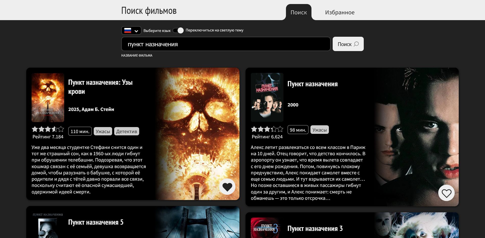
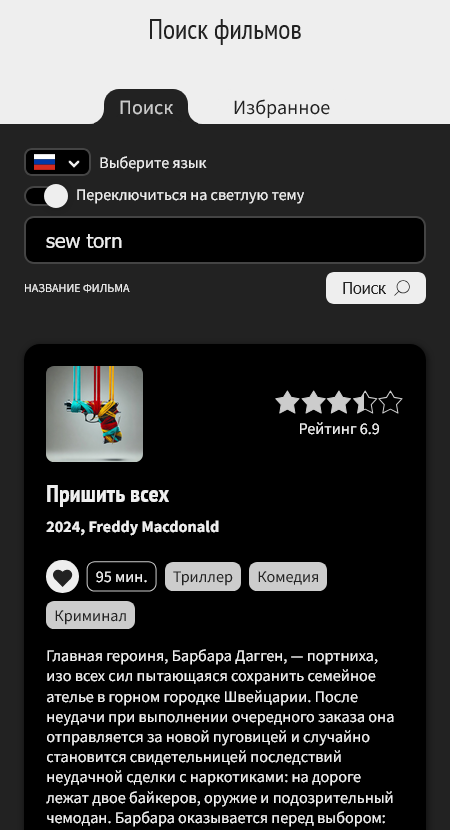
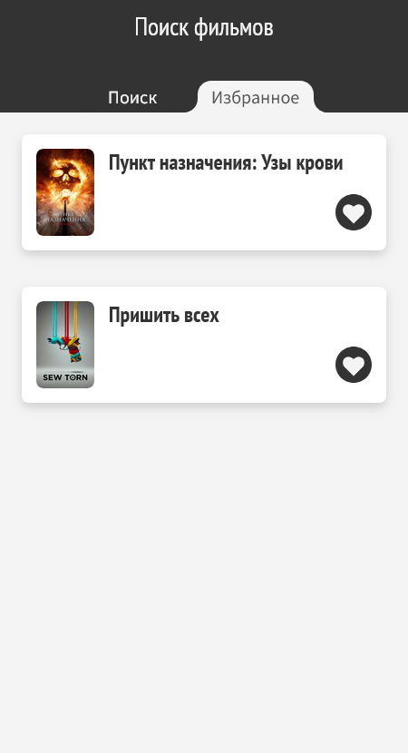
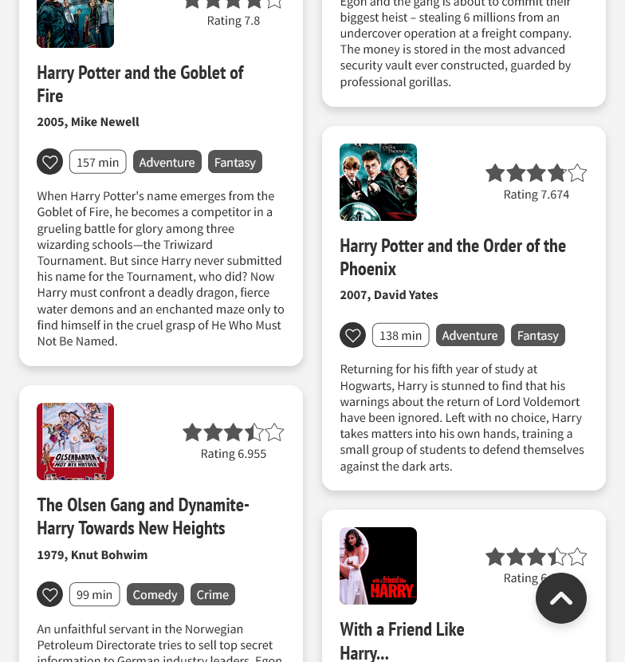

# Movie Search App

[**Открыть онлайн**](https://try-again-later.github.io/Movie-Search-App/)

Приложение для поиска фильмов через апи [TMDB](https://developer.themoviedb.org/reference/intro/getting-started) и сохранения их в список избранного, написанное на реакте.

---

[**Live version**](https://try-again-later.github.io/Movie-Search-App/)

 A react app for searching and saving movies to the favorites list with [TMDB](https://developer.themoviedb.org/reference/intro/getting-started) used as a backend. 

## Run locally

```sh
npm install
npm run dev
```

The app will be available at [localhost:5173/Movie-Search-App](http://localhost:5173/Movie-Search-App/).

## Screenshots



<p align="center">
  
</p>
